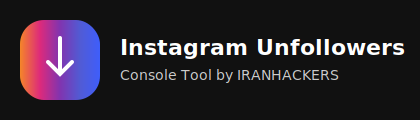

<div align="center">

# Instagram Unfollowers – Console Tool  
### Scan your followings & unfollow non-followers directly from the browser console

**English | [فارسی](#فارسی)**

<br>



<br><br>


</div>

---

# English

## 📌 Overview

This project is a fully client-side JavaScript tool that runs **inside the browser DevTools Console** on Instagram.

It helps you:

- Scan your **followings** list
- Detect users who **do not follow you back**
- Select and **unfollow** them with delays
- Copy the list of usernames to clipboard
- Filter out **verified** accounts
- Reduce the chance of **temporary blocks** with smart sleeps

> ⚠️ Disclaimer  
> This project is for **educational purposes** only and is not affiliated with Instagram.  
> Excessive use may cause temporary action blocks or restrictions. Use at your own risk.

---

## 📂 Project Structure

```text
instagram-unfollowers-console/
├─ src/
│  └─ instagram-unfollowers.js        # Clean readable source version
├─ dist/
│  └─ instagram-unfollowers.min.js    # Minified version for console (recommended)
├─ assets/
│  ├─ logo.svg                        # Project logo
│  └─ screenshot-ui.png               # Screenshot of the overlay UI (optional)
├─ CONTRIBUTING.md
├─ LICENSE
└─ README.md
